# upskillu

UpSkillU is a Flutter-based educational app designed to help learners **explore, discover,  enroll and feedback in courses** that enhance their knowledge and professional skills.

## Getting Started

This project is middle point for a Flutter application.

## 🚀 Features
- 🎓 Browse and select courses   
- 📖 View detailed information about each course  
- ❤️ Enroll your preferred courses  
- 🌈 Clean and responsive UI for all screen sizes  
- ⚡ Fast performance and smooth navigation
- ⭐ Feedback so we can improve us.

## 🛠️ Built With
- **Flutter** (Dart)  
- **Material Design** for UI

## ⚙️ Installation & Setup

1. Clone this repository:
   ```bash
   git clone https://github.com/IsratJahanSamiha/UpSkillU.git

2. Navigate to the project folder:
   cd UpSkillU

3. Install Flutter dependencies:
  flutter pub get
  
4. Run the app:
  flutter run


## 📱 App Screenshots

### LogIn
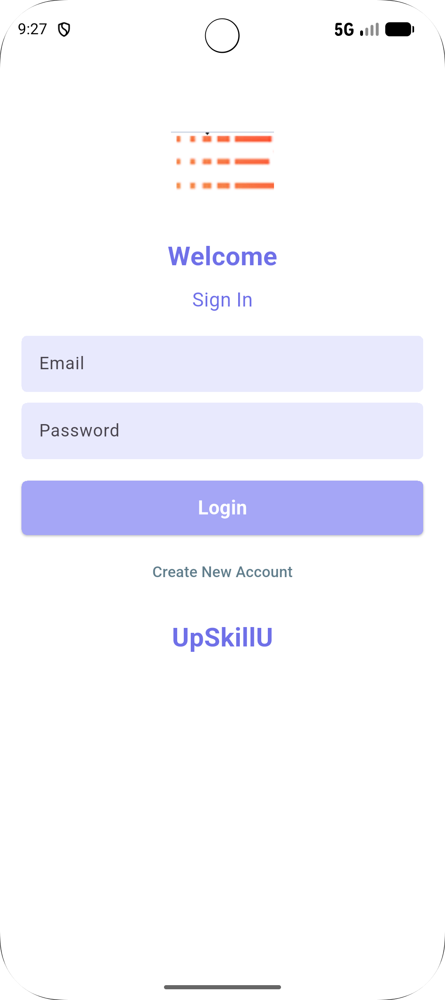

### SignUp
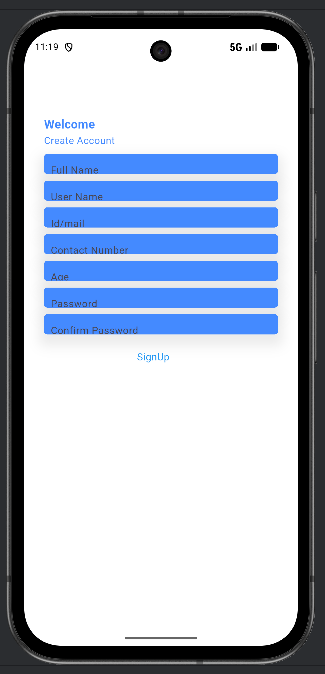

### Home
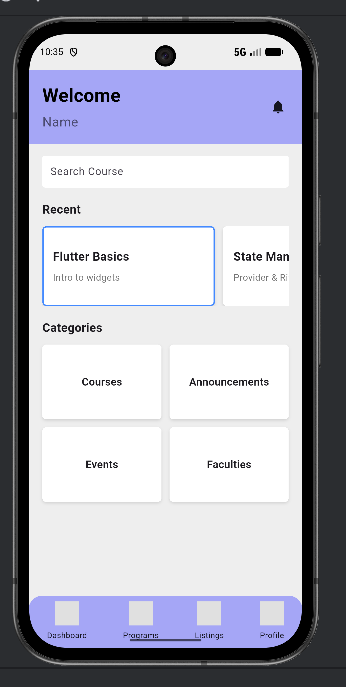

### 📚 Course List
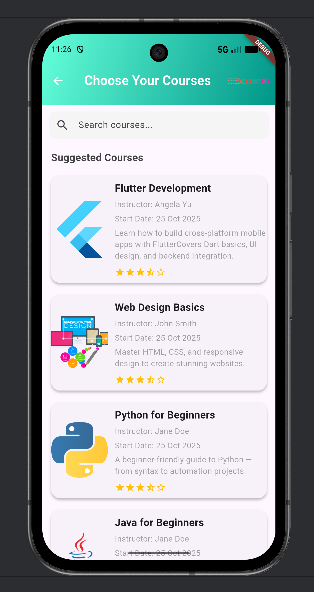

### 🎓 Browse
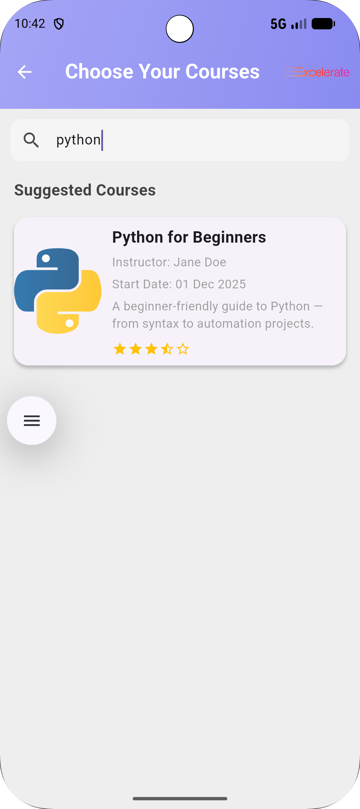~
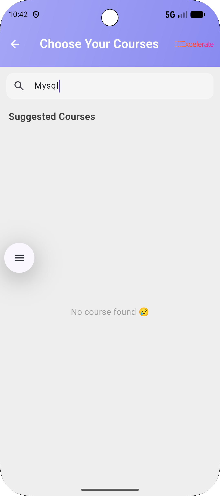

### 📖 Course Details
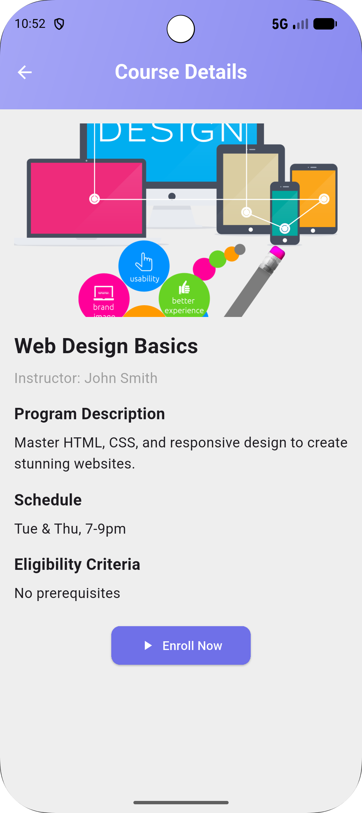

### ❤️ Enroll
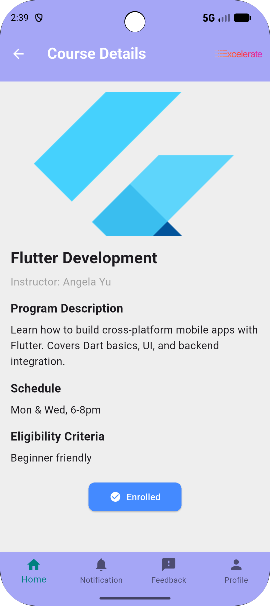

### Feedback
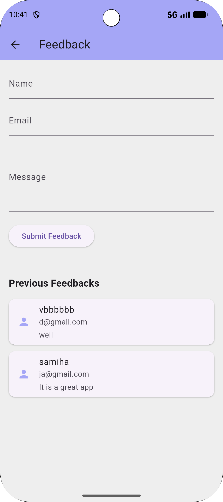
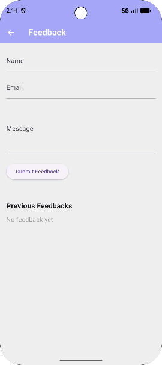


### Notification
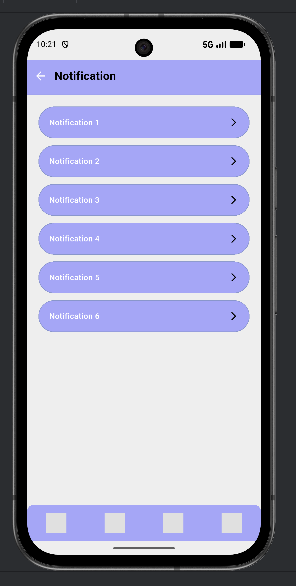

### Profile
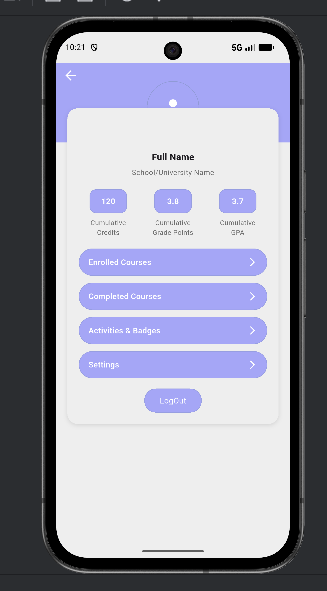


## 🎬 App Demo

<a href="https://youtube.com/shorts/-wZjWKIYC_c" target="_blank">
  
</a>

> 📱 Click the image above to watch the demo video on YouTube.


<br>
<br>

## 🎬 Finally Polished & Functional App Demo: State Management, Mock API & Form Validation

<a href="https://youtu.be/XBcFnhj1A10" target="_blank">
  
</a>

> 📱 Click the image above to watch the demo video on YouTube.


Lot of updates comeing soon.


A few resources to get you started if this is your first Flutter project:

- [Lab: Write your first Flutter app](https://docs.flutter.dev/get-started/codelab)
- [Cookbook: Useful Flutter samples](https://docs.flutter.dev/cookbook)

For help getting started with Flutter development, view the
[online documentation](https://docs.flutter.dev/), which offers tutorials,
samples, guidance on mobile development, and a full API reference.
